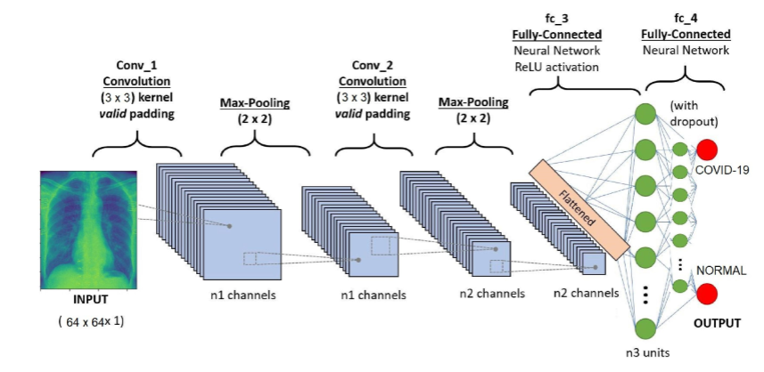
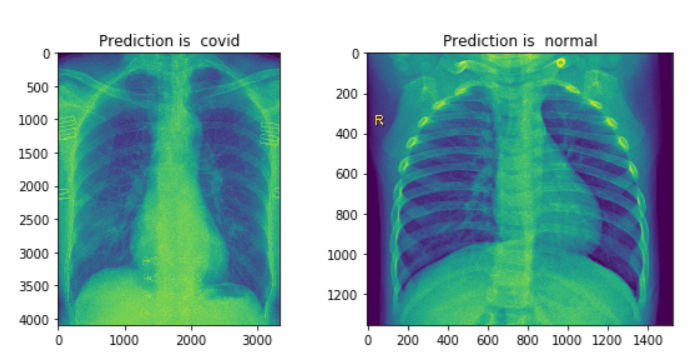
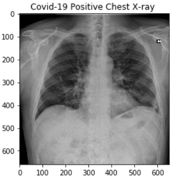

# COVID-19-Deep-Learning-CNN-Model
**Introduction**

COVID-19 (coronavirus disease 2019) infection which began in De- cember 2019 in Wuhan, China has widely spread all over the world. 
COVID-19 causes severe respiratory symptoms and is associated with relatively high ICU admission and mortality. 
Along with the continuously increasing number of cases, test kits were produced by aiming diagnosis. But according to the Hematology Fellow Atilla Uslu from Ankara University 
School of Medicine, “They started to have cases where the coronavirus test was negative twice, but lung tomography seemed compatible with coronavirus. 
How the samples are taken from the mouth and nose affects the results. When not properly taken, these tests can produce incorrect results” 26 March 2020, Tweet.
Also, it has been reported that the sensitivity of the test kits might not be high enough for the early detection and treat- ment of presumptive patients [1]. 
Therefore, the CT scan images of the lungs play a significant role in the early detection of the COVID- 19.

**Purpose of the study** 

This study aims to design and develop a deep learning model for early detection of the COVID-19 by using chest x-ray images.

**Data Collection** 

The data which will be used to train the model is open - source dataset called COVID-19 image data collection on the Github platform. 
According to this dataset, “The 2019 novel coronavirus (COVID-19) presents several unique features.
While the diagnosis is confirmed using polymerasechainreaction(PCR),infectedpatientswithpneumoniamay present on chest X-ray and computed 
tomography (CT) images with a pattern that is only moderately characteristic for the human eye Ng, 2020” ( Cohen J. Moorrison P. Dao L., 2020). 
This study is limited to 130 patients’ data for training the artificial intelligence model. 

**Conclusions** 

The final accuracy level of the deep learning model is recorded as 0.98 and the loss is recorded as 0.04.
We can also observe the accuracy-loss evolution values in the Figure 1.2. The deep learning model answers nearly the 0.98 of the 
chest x-ray images of the patients correctly and, distinguishes between the infected and not infected lungs which is the first target region of human body.

**Importance** 

According to the Bernheim (2020), “Chest CT is a vital component in the diagnostic algorithm for patients with suspected of infection. 
Indeed, given limited number Rrt-PCR kits in some centers and the possibility of false negative Rrt-PCR results,
the national Health Comission of the People’s Rebuplic of China has encouraged diagnosis based on clinical and chest CT findings alone” (Bernheim, MD A. 2020).

**Future Work** 
As a future work, the number of data which is used to train the CNN model can be increased and the general structure of convolutional neural 
network can be restructures so that it will be able to analyze images in more detail.

Best Regards.
F.Rabia Yapicioglu.

© 2019 ArcticAI. All rights reserved.
